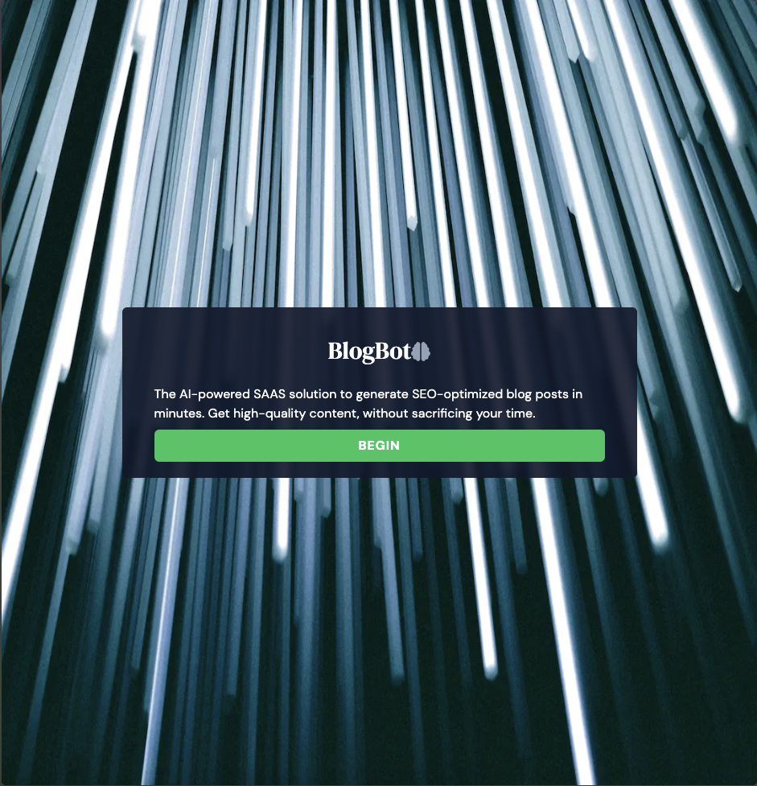
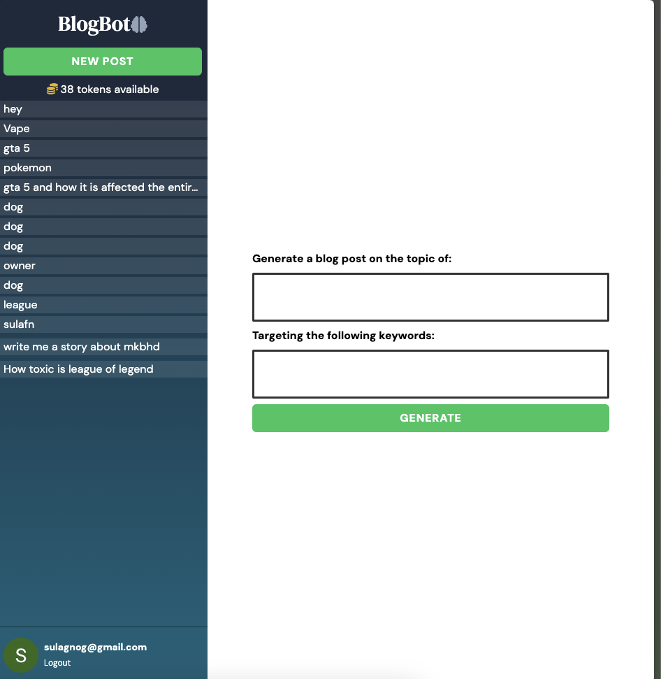

# Blogbot: Your AI-Powered SEO Blogging Solution

## Introduction


Welcome to Blogbot, the ultimate full-stack application designed for seamless and intelligent blogging experiences. Leveraging the power of Next.js, JavaScript, Tailwind CSS, MongoDB, and the OpenAI API, Blogbot specializes in creating SEO-optimized blog content. With the added functionality of Stripe for secure payments, Blogbot stands out as a comprehensive solution for bloggers, content creators, and digital marketers.

## Features

- **AI-Powered Content Generation**: Utilize OpenAI's cutting-edge API to generate engaging, SEO-friendly blog posts.
- **Next.js Framework**: Experience the robustness and flexibility of Next.js, ensuring a fast, scalable, and SEO-optimized blogging platform.
- **Stylish and Responsive Design**: Thanks to Tailwind CSS, Blogbot boasts a modern, responsive design that looks great on all devices.
- **Efficient Data Management**: MongoDB backend ensures efficient handling of blog data, user profiles, and more.
- **Monetization Enabled**: Integrate Stripe to offer premium content and accept payments seamlessly.
- **User-Friendly Dashboard**: Manage your blog, view analytics, and create content effortlessly with an intuitive user interface.

## Getting Started


1. **Clone the Repository**
   ```bash
   git clone https://github.com/your-username/blogbot.git
   cd blogbot

2. **Install Dependencies**
   ```bash
   npm install

3. **Run the application**
    ```bash
    npm run dev

## What problem is this solving?

In the **new age of AI**, it is really good to leverage the power and get an amazing template for your article. Surely the articles are great but it still requires a lot of human touch to make them perfect but this tool helps them get that Draft-1 and start their journey from there.


